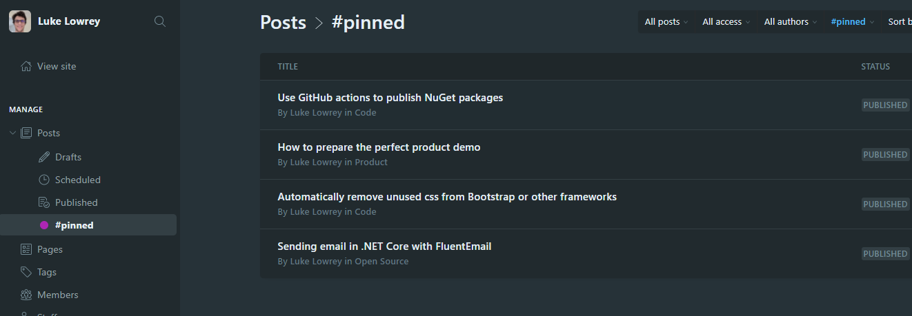
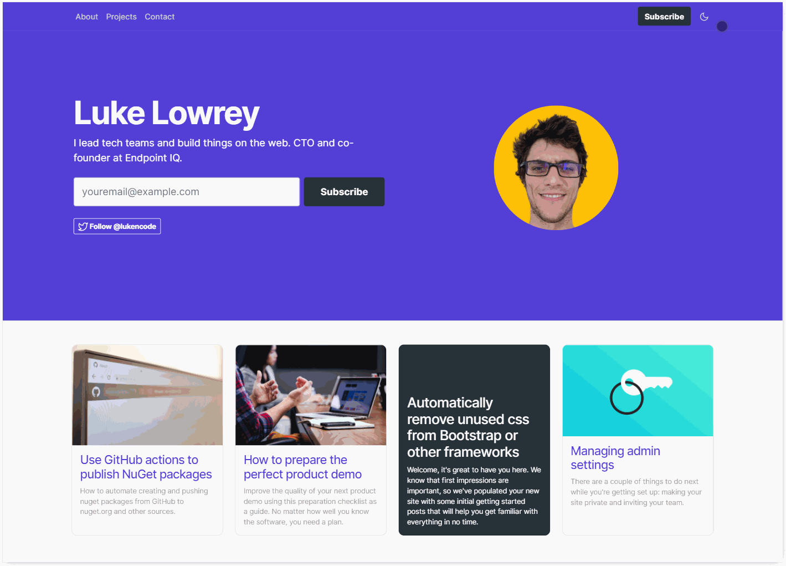

# GhostSolo Theme

A Ghost theme for solo bloggers. See it in action: **[lukelowrey.com](https://lukelowrey.com)**


&nbsp;

# Features

### #pinned Posts on the homepage
The homepage will render any posts with the internal tag "#pinned" as cards. Tip: add a "Pinned" tag filter to your Ghost dashboard.


### Membership support
GhostSolo currently supports free membership. You must **add a page named "Subscribe"** which will be used when people click the subscribe button in the header. The subscribe page will render the exerpt and body content you provide.

### Menus
The standard ghost navigation will render in the nav bar at the top of the page. Secondary navigation will render in the footer.

### Twitter / Facebook
The site twitter and facebook (soon) links will render as buttons in the homepage header.

### Author profile
The author profile bio and twitter will render at the end of each post.

# Customise

### Theme
GhostSolo uses CSS variables for overriding the theme and dark/light modes.

The default theme can be found in [assets/css/vars.css](https://github.com/lukencode/GhostSolo/blob/master/assets/css/vars.css). This can be easily overridden with a style tag in your ghost code injection settings.

```css
html:root {
    --accent-color: #543fd7;
    --bs-font-sans-serif: "Inter", system-ui, -apple-system, "Segoe UI", Roboto, "Helvetica Neue", Arial, "Noto Sans", sans-serif, "Apple Color Emoji", "Segoe UI Emoji", "Segoe UI Symbol", "Noto Color Emoji";
    --bs-font-serif: Georgia, serif;
    --bs-font-monospace: SFMono-Regular, Menlo, Monaco, Consolas, "Liberation Mono", "Courier New", monospace;
}

html[data-theme='light'] {
    --background-color: #fff;
    --alternate-background-colour: #f7f7f9;
    --text-color: #121416d8;
    --text-color-light: #777676bb;
    --link-color: var(--accent-color);
    --masthead-color: var(--accent-color);
    --masthead-text: #fff;
    --button-color: #263238;
    --button-text: #fff;
}

html[data-theme='dark'] {
    --background-color: #212a2e;
    --alternate-background-colour: #263238;
    --text-color: #F7F8F8;
    --text-color-light: #8A8F98;
    --link-color: #828fff;
    --masthead-color: #212a2e;
    --masthead-text: #fff;
    --button-color: var(--accent-color);
    --button-text: #fff;
}
```

### Dark mode
GhostSolo includes a simple toggle for enabling the dark/light modes. The toggle adds data-theme='dark/light' to the html element. It will automatically detect a user's preferred dark mode setting. When customising the theme be use to include both data-theme='dark' and data-theme='light' entries.



### Include Inter (or other) font
The base css theme uses the 'Inter' font. To include this in your blog add the following the your site header:
```html
<link href="https://fonts.googleapis.com/css2?family=Inter:wght@400;500;700&display=swap" rel="stylesheet">
```
If you override the base font be sure to include it in the header.

### Include Prism Syntax Highlighting

Include Prism syntax highlighting by adding the following to your Ghost blog code injection:

```html
In site header:
<link rel="stylesheet" href="https://cdnjs.cloudflare.com/ajax/libs/prism/1.20.0/themes/prism-twilight.min.css" integrity="sha256-rAcsWTglHtCcQgu1Lat/fUZqB+uBsYR+4dHZJUQ5Fug=" crossorigin="anonymous" />

In site footer
<script src="https://cdnjs.cloudflare.com/ajax/libs/prism/1.20.0/components/prism-core.min.js" integrity="sha256-9h14mWYYiQGkeAKg2JtijbqApb56kgw57WN6sI6dwH0=" crossorigin="anonymous"></script>
<script src="https://cdnjs.cloudflare.com/ajax/libs/prism/1.20.0/plugins/autoloader/prism-autoloader.min.js" integrity="sha256-3S2PESHNt0YNL65z57WuHPHIv12fibpBDXepyCGHftw=" crossorigin="anonymous"></script>
```

# Development

GhostSolo uses Bootstrap 5 for its base CSS. Styles are compiled using gulp, sass and PostCSS.
You'll need [Node](https://nodejs.org/)and [Gulp](https://gulpjs.com) installed globally. After that, from the theme's root directory:

```bash
# Install
npm run install

# Run build & watch for changes
npm run dev
```

Now you can edit `/assets/css/` files, which will be compiled to `/assets/built/` automatically.

The `zip` Gulp task packages the theme files into `dist/ghostsolo.zip`, which you can then upload to your site.

```bash
npm run zip
```

&nbsp;